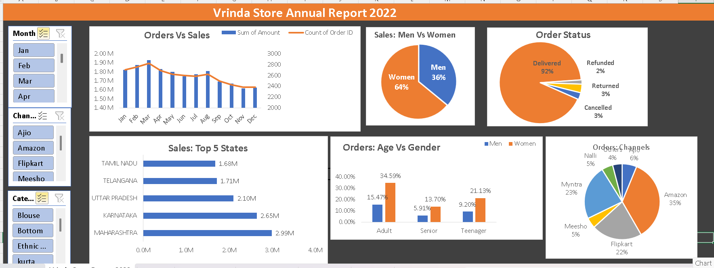

# Vrinda Store Sales Dashboard (Excel Project)

## Tools Used
- Microsoft Excel
- Pivot Tables
- Pivot Charts
- Slicers

## Project Overview
This project analyzes the annual sales performance of Vrinda Store using an interactive Excel dashboard.

## Key Insights
- Women contribute 64% of total sales.
- Amazon generates the highest orders (35%).
- Maharashtra is the top performing state.
- 92% of orders are successfully delivered.
## Dashboard Preview

